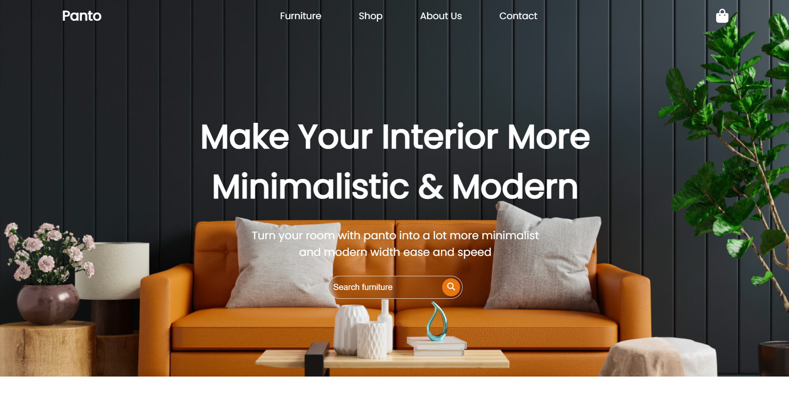

# Furniture website (IT)

[Clicca qui per il post su linkedin + video presentazione](https://www.linkedin.com/posts/michele-serafini-08574b1b7_react-typescript-webdevelopment-activity-7202246430663565313-n_1R?utm_source=share&utm_medium=member_desktop)
## Descrizione progetto

Questo progetto è una landing page dedicata agli arredamenti, progettato per fornire una navigazione intuitiva e un'esperienza utente ottimale, con un design semplice e responsive. La pagina è strutturata in diverse componenti per facilitare la gestione e lo sviluppo del codice. Questo progetto è stato costruito tramite React.js e Typescript.

## Stato attuale

La struttura della homepage è divisa in tre componenti principali e popolata da dati statici, presenti in file dedicati:

1) HomepageHeader: Gestisce la parte superiore della homepage, inclusa la barra di navigazione e la searchbar.
2) HomepageMain: Contiene il contenuto principale della homepage, come i benefits, i prodotti più venduti e altre sezioni descrittive.
3) HomepageFooter: Include le informazioni di contatto, link utili e altre informazioni di chiusura della pagina.

## Possibili upgrade futuri

Ovviamente per ora è solamente una homepage, ma potrebbe sicuramente diventare qualcosa di più ampio:
- Popolando le sezioni delle pagine con i dati tramite API costruite su un backend e un db
- Creazione di vero e proprio backoffice per gestire le risorse
- Implementazioni di altre pagine tramite lo strumento di routing delle SPA
- Implementazione di un vero e proprio carrello, con tutte le interazioni e una sezione di ordine e pagamento (visto che ora l'icona dello "shopping cart" è solo finta)

## Considerazioni finali

Sono particolarmente contento di questo mini progetto perché mi ha permesso di sperimentare con i componenti react integrando la tipizzazione di typescript; Inoltre ho potuto fare pratica anche sui requisiti di accessibilità, utilizzando sistemi di verifica automatica, ma anche manuale tramite l'uso di NVDA.

# Furniture Website (EN)
[Click here for the linkedin post + video presentation](https://www.linkedin.com/posts/michele-serafini-08574b1b7_react-typescript-webdevelopment-activity-7202246430663565313-n_1R?utm_source=share&utm_medium=member_desktop)

## Project Description

This project is a landing page dedicated to furniture, designed to provide intuitive navigation and an optimal user experience, with a responsive and simple design. The page is structured into different components to facilitate code management and development. This project was built using React.js and Typescript.

# Current Status

The homepage structure is divided into three main components and is currently populated with static data:

1) HomepageHeader: Manages the top part of the homepage, including the navigation bar and the search bar.
2) HomepageMain: Contains the main content of the homepage, such as benefits, best-selling products, and other descriptive sections.
3) HomepageFooter: Includes contact information, useful links, and other closing information of the page.

## Possible future upgrades

Obviously for now it's just a homepage, but it could definitely become something broader:
- Populating page sections with data via APIs built on a backend and a db
- Creation of a real backoffice to manage resources
- Implementations of other pages using the SPA routing tool
- Implementation of a real shopping cart, with all the interactions and an order and payment section (since now the "shopping cart" icon is only fake)

## Final considerations

I am particularly happy with this mini project because it allowed me to experiment with react components by integrating typescript typing; Furthermore, I was also able to practice on accessibility requirements, using automatic verification systems, but also manual ones through the use of NVDA.

### Design credits

[Panto furniture landing page design](https://www.kretyastudio.com/product)